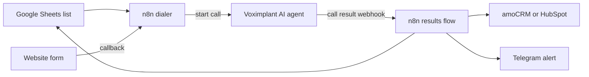

# n8n automation workflows

n8n workflows that connect AI voice agents with the CRM, Google Sheets and Telegram. They turn every call into a lead that the sales team can work with, without manual copying.

## The problem

A voice agent is only useful if the result of each call reaches the sales team. Without automation, managers copy names and phone numbers from transcripts by hand, and leads get lost.

## What I built

- **Outbound dialer.** Takes a contact list from Google Sheets, starts AI calls through Voximplant one by one and writes the result of each call back to the sheet.
- **Call results to CRM.** After a call the agent sends a structured result. The workflow creates or updates the contact and deal in amoCRM or HubSpot and sends a short card to the team in Telegram.
- **Website callback.** A visitor leaves a phone number on the site and gets a call from the AI agent.
- **Voice bot on VAPI.** Function calls from the voice bot (save lead, send a selection of listings) handled in n8n.
- **Lead intake for BrokerDesk.** Leads from voice, chat and WhatsApp land in one HubSpot pipeline with stages and owners.

## How it works

## Stack

n8n, Voximplant, VAPI, amoCRM API, HubSpot API, Telegram Bot API, Google Sheets API, webhooks.

## My role

I designed and built all workflows and integrations, and connected them to the voice agents I built.

## Code

The source code is private. I can walk you through the project on a call.

## License

All rights reserved, see [LICENSE](LICENSE).
